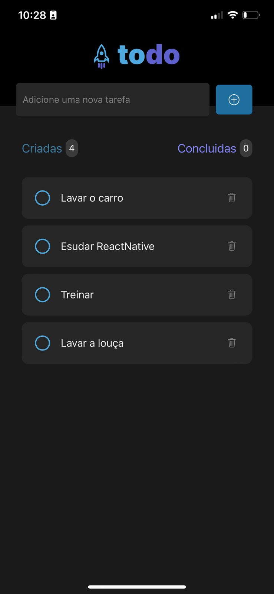

# App de Lista de Tarefas RocketTodoList

Este é um projeto de um aplicativo de lista de tarefas desenvolvido com fins didáticos. Ele permite aos usuários criar, listar e excluir tarefas de forma simples e eficaz.

## Funcionalidades Principais

- Adicionar novas tarefas à lista.
- Marcar tarefas como concluídas.
- Excluir tarefas da lista.
- Alternar entre a visualização de tarefas criadas e concluídas.

## Uso

Para executar o aplicativo em seu ambiente de desenvolvimento, siga estas etapas:

1. Clone este repositório em sua máquina local.
2. Instale as dependências necessárias usando `npm install` ou `yarn install`.
3. Execute o aplicativo em um emulador ou dispositivo usando `npx expo start` ou `yarn start`.

## Contribuições

Contribuições são bem-vindas! Se você gostaria de melhorar este aplicativo ou adicionar novos recursos, sinta-se à vontade para criar um fork deste repositório e enviar um pull request.

## Créditos

Desenvolvido por [Bertone Oliveira](https://github.com/soubertone) | © Bertone Oliveira. Todos os direitos reservados.

